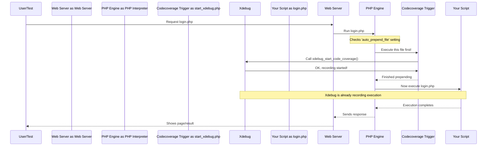

# Chapter 1: Coverage Collection Trigger

Welcome to the `codecoverage` tutorial! We're excited to help you understand how code coverage works, step by step. In this first chapter, we'll explore the very beginning of the process: the **Coverage Collection Trigger**.

Imagine you want to film a short movie of your friend performing a cool skateboard trick. What's the absolute first thing you need to do? You need to press the 'record' button on your camera *before* your friend starts the trick! If you press it too late, you'll miss the beginning.

The Coverage Collection Trigger in `codecoverage` works exactly like that 'record' button. Its job is to make sure that as soon as your PHP script starts running, we begin recording which lines of code are being executed.

## Why Do We Need a Trigger?

Let's think about a simple use case. Suppose you have a website with a login page (`login.php`). You want to test if the login works correctly. When you run your automated test (or even log in manually), the `login.php` script runs, along with potentially many other PHP files it uses.

**The Problem:** How do we make sure we capture *every single line of code* that runs during that login process, right from the very start?

**The Solution:** We need a mechanism that automatically starts the "recording" the moment PHP begins executing the `login.php` script. This is what the Coverage Collection Trigger does.

## How It Works: Starting the Recording

The `codecoverage` tool uses a popular PHP extension called Xdebug. Xdebug has the built-in ability to monitor code execution. Our trigger mechanism simply tells Xdebug: "Hey, start monitoring now!"

This "telling" happens in a specific file, often named something like `start_xdebug.php`. Let's look at the crucial part:

```php
<?php
// File: start_xdebug.php (Simplified)

// This is the magic line! It tells Xdebug to start recording.
xdebug_start_code_coverage();

// (Other setup code might follow, but this is the core trigger)
// ...
?>
```

**Explanation:**

*   `<?php ... ?>`: These tags indicate the start and end of PHP code.
*   `xdebug_start_code_coverage();`: This is a function provided by the Xdebug extension. Calling this function is like pressing the 'record' button. From this point forward, Xdebug watches every line of PHP code that gets executed.

It's that simple! By ensuring this line runs at the very beginning, we guarantee that coverage collection starts immediately.

*(Note: You might see commented-out lines like `//xdebug_start_code_coverage(XDEBUG_CC_UNUSED | XDEBUG_CC_DEAD_CODE);`. These are options for more advanced coverage modes, like detecting unused code, but the basic `xdebug_start_code_coverage();` is enough to get started.)*

## Under the Hood: How Does it Run First?

You might be wondering, "How does this `start_xdebug.php` file run automatically before my actual script like `login.php`?"

Good question! This is usually configured in the PHP settings (often in a file called `php.ini` or server configuration like `.htaccess`). There's a setting called `auto_prepend_file`. You tell PHP: "Before you run *any* PHP script, please automatically run the contents of this specific file first."

We set `auto_prepend_file` to point to our `start_xdebug.php`.

Here’s a simplified step-by-step flow:

1.  You try to access `login.php` in your browser (or your test runs it).
2.  The web server asks the PHP interpreter to run `login.php`.
3.  PHP checks its configuration and sees the `auto_prepend_file` setting pointing to `start_xdebug.php`.
4.  **Crucially:** PHP first runs *all* the code inside `start_xdebug.php`.
5.  Inside `start_xdebug.php`, the `xdebug_start_code_coverage()` function is called. Xdebug starts monitoring.
6.  Once `start_xdebug.php` finishes, PHP proceeds to run your actual `login.php` script.
7.  Because Xdebug was already started (in step 5), it records the execution of `login.php` right from its first line.

Let's visualize this:



## What Happens Next?

Okay, so we've successfully pressed 'record' using the Coverage Collection Trigger. Xdebug is now dutifully noting every line of code that runs.

But just like with our video camera, starting the recording is only the first step. We also need to know:

1.  **When to stop recording?** We can't record forever!
2.  **How to save the recording?** What good is recording if we don't save the results?
3.  **What test was this recording for?** If we run multiple tests, how do we know which recording belongs to the login test versus, say, a registration test?

These questions lead us directly to the next parts of the `codecoverage` system.

## Conclusion

In this chapter, we learned about the **Coverage Collection Trigger**. It's the essential first step in the code coverage process, acting like the 'record' button on a camera. It uses the `xdebug_start_code_coverage()` function, typically placed in a file specified by PHP's `auto_prepend_file` setting, to ensure that code execution monitoring begins right when a script starts.

Now that we know how to *start* collecting coverage, let's move on to the next logical step: how the system ensures the coverage data is properly collected and saved when the script finishes. This involves understanding the [Graceful Shutdown Execution](02_graceful_shutdown_execution.md).

---

Generated by [AI Codebase Knowledge Builder](https://github.com/The-Pocket/Tutorial-Codebase-Knowledge)