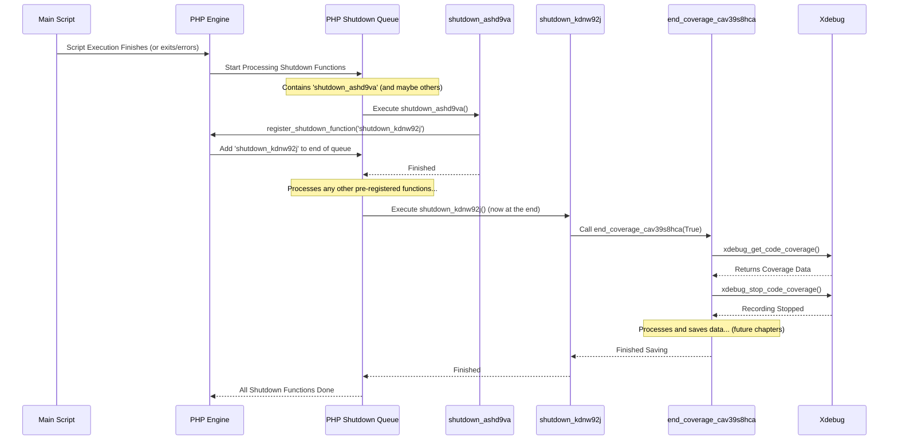

# Chapter 2: Graceful Shutdown Execution

In [Chapter 1: Coverage Collection Trigger](01_coverage_collection_trigger.md), we learned how `codecoverage` starts recording which lines of code are run, just like pressing the 'record' button on a camera right at the beginning.

Now, imagine the main event (your script running) is over. What happens next? We need to make sure we stop the recording and safely store the collected data. But what if the script ends unexpectedly? Maybe it encounters an error, or maybe a programmer used an `exit()` command somewhere. How can we *guarantee* that our cleanup process (stopping recording, saving data) always runs, no matter how the main script finishes?

This is where **Graceful Shutdown Execution** comes in. It's like having a super-reliable cleanup crew that *always* comes in after the party is over, even if the party ended abruptly, to make sure everything is tidied up correctly.

## Why Do We Need a "Cleanup Crew"?

Let's go back to our `login.php` example. We started recording coverage when the script began. The script runs, checks the user's password, logs them in, and then... it finishes.

**The Problem:** We need to tell Xdebug to *stop* recording and then collect the data it gathered. If we don't do this, the coverage information is lost! Worse, what if `login.php` hits a critical error halfway through? Or what if another piece of code calls `exit;` prematurely? We still need our "stop recording and save" logic to run.

**The Solution:** We need a mechanism that PHP guarantees will execute *after* the main script has finished its work, regardless of *how* it finished (normally, with an error, or via `exit`).

## How It Works: PHP's `register_shutdown_function`

PHP has a built-in function perfectly suited for this: `register_shutdown_function()`.

You give this function the name of another function you want PHP to run *later*. PHP keeps a list of these "shutdown functions". When the main script is completely done, PHP goes through this list and runs each function, one by one.

Think of it like leaving instructions for the venue staff: "After the event finishes, please run these cleanup tasks."

Here's a simple example:

```php
<?php

function my_cleanup_task() {
  echo "The script has ended. Cleaning up now!";
  // In reality, we'd stop coverage and save data here.
}

// Tell PHP: "When this script ends, please run 'my_cleanup_task'"
register_shutdown_function('my_cleanup_task');

echo "Main script is running...";
// ... lots of code might run here ...
echo "Main script is about to finish.";

// No matter what happens after this (even errors or exit),
// 'my_cleanup_task' will eventually be called by PHP.

?>
```

**If you run this:**

1.  It prints "Main script is running..."
2.  It prints "Main script is about to finish."
3.  The script ends.
4.  PHP then calls `my_cleanup_task`.
5.  It prints "The script has ended. Cleaning up now!"

## The Challenge: Ensuring We Run *Last*

Okay, `register_shutdown_function` is great. But what if other parts of the code (or other libraries) *also* register their own shutdown functions? PHP runs these functions in the order they were registered.

For `codecoverage`, it's crucial that we stop recording and collect the data *after absolutely everything else* has finished. If another shutdown function runs *after* ours, any code executed by *that* function won't be included in our coverage report! We need to be the very last cleanup crew member to leave.

## The Clever Trick: Nested Shutdown Functions

How do we guarantee our function runs last? `codecoverage` uses a neat trick involving *nested* shutdown functions. It works like this:

1.  **Register Function A:** Right at the start (in that same `start_xdebug.php` file from Chapter 1), we register a *first* shutdown function (let's call it `shutdown_A`).
2.  **Function A Registers Function B:** When PHP eventually calls `shutdown_A` during the shutdown phase, the *only* thing `shutdown_A` does is register a *second* shutdown function (let's call it `shutdown_B`).
3.  **PHP's Queue:** When `shutdown_A` registers `shutdown_B`, PHP adds `shutdown_B` to the *end* of the current queue of shutdown functions that still need to run.
4.  **Function B Runs Last:** Because `shutdown_B` was added to the queue *during* the shutdown process itself, it's guaranteed to be processed after any function that was registered *before* the shutdown process began. `shutdown_B` is the function that will actually contain our logic to stop Xdebug and save the coverage data.

Let's look at the simplified code from `start_xdebug.php` that sets this up:

```php
<?php
// File: start_xdebug.php (Simplified Shutdown Part)

// Start coverage (as seen in Chapter 1)
xdebug_start_code_coverage();

// --- The Graceful Shutdown Setup ---

// This is our "Function A"
function shutdown_ashd9va()
{
    // Its ONLY job is to register Function B
    register_shutdown_function('shutdown_kdnw92j');
    // We add random-looking names to avoid conflicts
    // error_log('Registered shutdown_kdnw92j'); // Debugging message
}

// This is our "Function B" - the real cleanup crew
function shutdown_kdnw92j()
{
    // This function will be called very last.
    // error_log('Running shutdown_kdnw92j'); // Debugging message

    // Call the function that actually stops and saves coverage
    end_coverage_cav39s8hca(True);
}

// This function contains the logic to stop Xdebug and save data
function end_coverage_cav39s8hca($caller_shutdown_func=False)
{
    // error_log('Stopping coverage and saving data...'); // Debugging message

    // 1. Get the coverage data collected by Xdebug
    $codecoverageData = xdebug_get_code_coverage();

    // 2. Tell Xdebug to stop recording (if called from shutdown)
    if ($caller_shutdown_func) {
      xdebug_stop_code_coverage();
    }

    // 3. Process and save $codecoverageData
    // (This involves complex steps we'll cover later)
    // write_to_db_vb76bvgbasc(...); // Simplified call
    echo "Coverage data collected and processed!\n"; // Placeholder
}

// --- Register "Function A" right away ---
register_shutdown_function('shutdown_ashd9va');
// error_log('Registered shutdown_ashd9va'); // Debugging message

// The rest of the user's script would normally run after this file
echo "Main script logic would run here...\n";

?>
```

**Explanation:**

1.  `xdebug_start_code_coverage();`: Recording starts (from Chapter 1).
2.  `function shutdown_ashd9va()`: Defines the first shutdown function. Its *only* purpose is to register the second one.
3.  `function shutdown_kdnw92j()`: Defines the second shutdown function. This is the one that will do the actual work by calling `end_coverage_cav39s8hca`.
4.  `function end_coverage_cav39s8hca()`: Defines the function that gets the data (`xdebug_get_code_coverage()`), stops Xdebug (`xdebug_stop_code_coverage()`), and handles saving (details simplified here).
5.  `register_shutdown_function('shutdown_ashd9va');`: This line registers the *first* function (`shutdown_ashd9va`) with PHP's shutdown system immediately when `start_xdebug.php` runs.

## Under the Hood: The Shutdown Sequence

Let's visualize the sequence of events when a script using this mechanism finishes:



This diagram shows how `shutdown_ashd9va` acts solely to schedule `shutdown_kdnw92j` at the very end of the queue, ensuring `end_coverage_cav39s8hca` (which stops Xdebug) runs after everything else.

## What Happens Inside `end_coverage_cav39s8hca`?

The `end_coverage_cav39s8hca` function is where the magic of stopping and saving happens. We saw it calls `xdebug_get_code_coverage()` and `xdebug_stop_code_coverage()`. But what does it do with the data?

It needs to figure out:
1.  What test does this coverage data belong to?
2.  How should the raw data from Xdebug be organized?
3.  Where should this processed data be stored (e.g., a database, files)?

These questions lead us to the next steps in the process. The raw data needs to be collected, potentially combined with data from other requests belonging to the same test, and then stored persistently.

## Conclusion

In this chapter, we learned about **Graceful Shutdown Execution**. This crucial mechanism ensures that `codecoverage` can reliably stop recording and collect coverage data, even if the script terminates unexpectedly. It uses PHP's `register_shutdown_function` combined with a clever nesting trick (`shutdown_A` registers `shutdown_B`) to guarantee that the final data collection and processing steps run *absolutely last*.

We've started the recording ([Chapter 1: Coverage Collection Trigger](01_coverage_collection_trigger.md)) and ensured we can reliably stop it and grab the data (this chapter). Now, what do we *do* with that raw data collected by Xdebug? The next chapter explores how `codecoverage` handles this: [Coverage Data Aggregation](03_coverage_data_aggregation.md).

---

Generated by [AI Codebase Knowledge Builder](https://github.com/The-Pocket/Tutorial-Codebase-Knowledge)