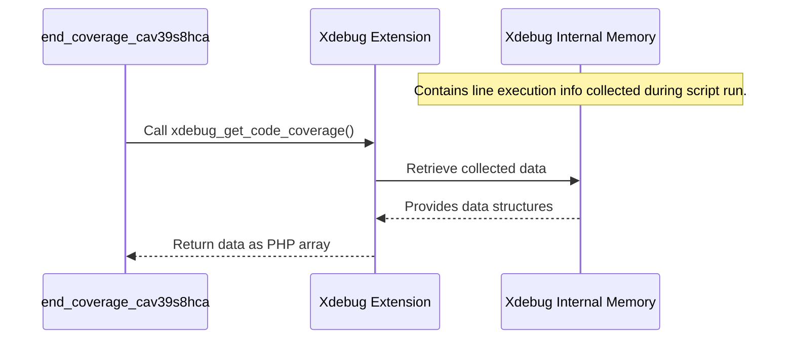

# Chapter 3: Coverage Data Aggregation

In the previous chapter, [Chapter 2: Graceful Shutdown Execution](02_graceful_shutdown_execution.md), we learned how `codecoverage` uses a clever shutdown mechanism to make sure it can reliably perform cleanup tasks *after* your script finishes running. This cleanup is crucial because it's where we stop the recording and collect the results.

Now, let's focus on one specific part of that cleanup: getting the actual coverage data. Think back to our analogy of filming a skateboard trick. Xdebug (our camera) has been recording which lines of code ran. Now, the trick is done, and the recording has stopped (thanks to the graceful shutdown). How do we get the video footage (the coverage data) out of the camera?

This step is called **Coverage Data Aggregation**. It's the process of gathering the raw data *from* Xdebug about which lines of code were executed during the script's run.

## Why Do We Need to "Aggregate" Data?

Imagine a diligent reporter taking notes throughout a long interview. They write down quotes, observations, and key points on different pages of their notebook. At the end of the interview, they don't just hand over the messy notebook! They first need to *gather* all those notes together into one place, perhaps organizing them slightly, before they can write their final article.

**Coverage Data Aggregation** is similar. While your script (`login.php`, for example) was running, Xdebug was internally making notes about every line it saw being executed. It wasn't constantly sending data somewhere; it was keeping track internally.

**The Problem:** The coverage data is stored inside Xdebug's memory *during* the script's execution. We need a way to ask Xdebug: "Okay, the script is done. Please give me all the information you collected."

**The Solution:** Xdebug provides a specific function that our cleanup code can call to retrieve this collected data. This act of retrieving the complete set of execution data from Xdebug is what we mean by "aggregation."

## How It Works: Asking Xdebug for the Data

Remember the `end_coverage_cav39s8hca` function from Chapter 2? This function runs very late in the script's lifecycle, thanks to our graceful shutdown trick. Inside this function, we make a call to Xdebug.

The key function is `xdebug_get_code_coverage()`. When this function is called, Xdebug looks at all the information it has recorded since `xdebug_start_code_coverage()` was called (back in [Chapter 1: Coverage Collection Trigger](01_coverage_collection_trigger.md)) and hands it back to our PHP code.

Let's look at the specific line within our cleanup function:

```php
<?php
// Inside function end_coverage_cav39s8hca(...) in start_xdebug.php

// 1. Ask Xdebug for the recorded data
$rawCoverageData = xdebug_get_code_coverage();

// $rawCoverageData now holds the raw information.
// This variable contains *everything* Xdebug recorded.
?>
```

**Explanation:**

*   `$rawCoverageData = ...`: We are storing the result in a PHP variable named `$rawCoverageData`.
*   `xdebug_get_code_coverage()`: This is the magic function call. We are essentially saying, "Hey Xdebug, give me the coverage report now!"

It's that straightforward! This one function call aggregates all the execution information Xdebug has been tracking.

## What Does the Raw Data Look Like?

What does Xdebug actually give us back? It returns a PHP array. This array uses the full path of each executed file as a key. The value associated with each file is *another* array, where the keys are line numbers, and the values indicate whether that line was executed.

Here's a simplified example of what `$rawCoverageData` might contain after running a test on `login.php`:

```php
<?php
// Example structure of $rawCoverageData (simplified)
$rawCoverageData = [
  // File 1: The main login script
  '/var/www/html/login.php' => [
    5 => 1,     // Line 5 was executed
    6 => 1,     // Line 6 was executed
    7 => 1,     // Line 7 was executed
    9 => -1,    // Line 9 is marked as dead code (unreachable)
    10 => 1,    // Line 10 was executed
    12 => -2    // Line 12 was not executed (unused)
  ],

  // File 2: A helper file included by login.php
  '/var/www/html/includes/auth_helper.php' => [
    20 => 1,    // Line 20 was executed
    21 => 1,    // Line 21 was executed
    25 => 1     // Line 25 was executed
  ]

  // ... potentially many more files ...
];
?>
```

**Explanation of Values:**

*   `1`: Means the line was executed.
*   `-1`: Means the line is considered "dead code" by Xdebug (e.g., code after a `return` or `exit` that can never be reached).
*   `-2`: Means the line *could* have been executed, but wasn't during *this specific run*.

This raw data is the core information we need to build our final coverage reports.

## Under the Hood: How Xdebug Provides the Data

You might wonder if calling `xdebug_get_code_coverage()` is a slow process. Does it have to re-analyze all the files?

No, Xdebug is efficient!

1.  **During Execution:** As your script runs (after `xdebug_start_code_coverage()`), Xdebug is already monitoring the execution flow and updating its internal data structures in memory to keep track of which lines in which files are being hit.
2.  **On Request:** When `xdebug_get_code_coverage()` is called, Xdebug simply accesses this internal data it has already prepared and formats it into the PHP array structure we saw above. It doesn't need to re-scan code or redo analysis.

Let's visualize this interaction:



This shows that our cleanup function (`end_coverage_cav39s8hca`) simply asks the Xdebug extension for the data, which Xdebug retrieves from its internal memory where it was stored during the script's run.

## Putting it in Context

Let's see where this aggregation step fits within the `end_coverage_cav39s8hca` function from `start_xdebug.php`:

```php
<?php
// Simplified view of end_coverage_cav39s8hca(...)

function end_coverage_cav39s8hca($caller_shutdown_func=False)
{
    // (Code to figure out test name, etc. - Chapter 4)
    // ...

    try {
        // ---> Step 1: AGGREGATION <---
        // Get the raw coverage data from Xdebug's internal memory.
        $rawCoverageData = xdebug_get_code_coverage();

        // (Optional: Convert to JSON for easier handling/storage)
        $codecoverageDataJson = json_encode($rawCoverageData);

        // ---> Step 2: Stop Recording <---
        // Tell Xdebug we're done with this coverage session.
        if ($caller_shutdown_func) {
          //error_log('calling xdebug stop');
          xdebug_stop_code_coverage();
        }

        // ---> Step 3: Save the Data <---
        // (Pass the aggregated data to be saved - Chapter 5)
        // write_to_db_vb76bvgbasc($coverageName, ..., $codecoverageDataJson, ...);
        echo "Coverage data aggregated and ready for storage!\n"; // Placeholder

    } catch (Exception $ex) {
        error_log("Error during coverage aggregation/saving: " . $ex->getMessage());
        // Handle potential errors
    }
}
?>
```

This shows the logical flow: first, we **aggregate** the data using `xdebug_get_code_coverage()`, then we stop Xdebug, and finally, we prepare to save the aggregated data (which we'll cover later).

## What's Next?

We've successfully gathered the raw data! Our reporter has collected all their notes. But just having the raw data isn't enough. If we run multiple tests (login, registration, password reset), we get multiple sets of raw coverage data. How do we know *which* data belongs to the login test versus the registration test?

Before we can save the data, we need to figure out its context. This leads us directly to the next chapter: [Chapter 4: Test Context Identification](04_test_context_identification.md).

## Conclusion

In this chapter, we explored **Coverage Data Aggregation**. We learned that this step involves calling the `xdebug_get_code_coverage()` function within our shutdown process. This function retrieves the detailed execution data (which lines ran in which files) that Xdebug collected while the script was running. Think of it as asking the reporter for their complete, raw notes after the interview.

Now that we have the raw data, our next challenge is to label it correctly so we know which test it came from. Let's move on to [Chapter 4: Test Context Identification](04_test_context_identification.md) to see how `codecoverage` figures this out.

---

Generated by [AI Codebase Knowledge Builder](https://github.com/The-Pocket/Tutorial-Codebase-Knowledge)