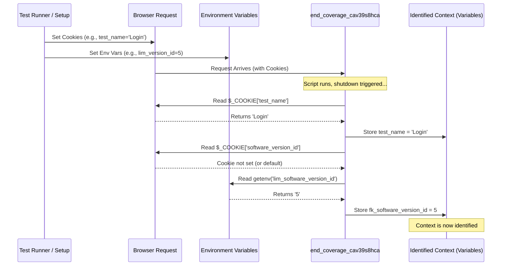

# Chapter 4: Test Context Identification

In the previous chapter, [Chapter 3: Coverage Data Aggregation](03_coverage_data_aggregation.md), we saw how `codecoverage` collects the raw data from Xdebug about which lines of code were executed. We used `xdebug_get_code_coverage()` to get this information, like collecting all the raw notes after an interview.

But imagine you conducted *several* interviews on the same day. If you just have piles of raw notes, how do you know which notes belong to which interview? You need labels! This is exactly the problem **Test Context Identification** solves for our code coverage data.

## Why Do We Need Labels?

Let's say you're testing a website. You might have different automated tests:

1.  A test for logging in successfully.
2.  A test for trying to log in with a wrong password.
3.  A test for registering a new user.

Each of these tests will cause different parts of your code to run. `codecoverage` will collect coverage data for each test run.

**The Problem:** When the `codecoverage` system saves the data from the "successful login" test, how does it know to label it as "Successful Login Test"? How does it distinguish this data from the data collected during the "failed login" test or the "registration" test? Without labels, all the coverage data gets mixed up, making it useless for analysis.

**The Solution:** We need a way to automatically figure out the *context* of the current test run. This context typically includes:

*   **Test Name:** A unique name for the specific test being run (e.g., "Login Success Test").
*   **Test Group:** A way to categorize tests (e.g., "Authentication", "User Profile").
*   **Software Version:** The version of the application being tested (e.g., "v1.2.0").
*   **Software ID:** A unique identifier for the software project.

Just like labeling a recorded meeting video with the date, topic, and attendees, Test Context Identification labels the coverage data so we know exactly what it represents.

## How It Works: Finding the Context Information

Where does `codecoverage` find these labels? It typically looks in two main places:

1.  **Browser Cookies:** When tests are run through a web browser (either manually or using automation tools like Selenium), the testing tool can often set cookies in the browser before the test starts. These cookies can contain the test name, group, version, etc. When our PHP script runs, it can read these cookies.
2.  **Environment Variables:** For tests run from the command line, or in environments where cookies aren't practical (like CI/CD pipelines), the context information can be set as environment variables. PHP scripts can easily read these variables.

Think of cookies like a sticky note attached to a web request, and environment variables like instructions written on the wall of the room where the script is running. Our code just needs to look for these notes or instructions.

## Implementation in `codecoverage`: Reading Cookies and Environment Variables

This context identification happens within the same `end_coverage_cav39s8hca` function we discussed in previous chapters – the one that runs at the very end thanks to the [Graceful Shutdown Execution](02_graceful_shutdown_execution.md).

Before saving the data gathered via [Coverage Data Aggregation](03_coverage_data_aggregation.md), the script tries to find the context information.

**Step 1: Check Browser Cookies**

The code first looks for specific cookie names:

```php
<?php
// Inside function end_coverage_cav39s8hca(...) in start_xdebug.php

// Try to get test context from cookies
$test_name = isset($_COOKIE['test_name']) ? htmlspecialchars($_COOKIE['test_name']) : 'unknown_test_' . time();
$fk_software_id = isset($_COOKIE['software_id']) ? intval($_COOKIE['software_id']) : -1;
$fk_software_version_id = isset($_COOKIE['software_version_id']) ? intval($_COOKIE['software_version_id']) : -1;
$test_group = isset($_COOKIE['test_group']) ? htmlspecialchars($_COOKIE['test_group']) : 'default';

// $test_name will contain the value of the 'test_name' cookie, or a default value.
// $test_group will contain the value of the 'test_group' cookie, or 'default'.
// $fk_software_id and $fk_software_version_id get integer values from cookies or -1.
?>
```

**Explanation:**

*   `$_COOKIE`: This is a special PHP variable that holds all the cookies sent by the browser with the current request.
*   `isset($_COOKIE['test_name'])`: Checks if a cookie named `test_name` actually exists.
*   `? ... : ...`: This is a shorthand "if-else". If the cookie exists (`isset` is true), use its value; otherwise (`:`), use a default value (like `'unknown_test_'` plus the current time).
*   `htmlspecialchars(...)`: A security measure to prevent issues if the cookie contains weird characters. It makes the text safe to display or store.
*   `intval(...)`: Converts the cookie value (which is usually text) into a whole number (integer).

**Step 2: Check Environment Variables (Fallback)**

If the cookies weren't set, or if they still have the default values (like `test_group` being 'default'), the code then checks for environment variables as a backup plan:

```php
<?php
// Inside function end_coverage_cav39s8hca(...)

// If the test group is still 'default' (meaning cookie wasn't set or useful)
if ($test_group == 'default') {
    // Try to read context from environment variables
    $cfg_test_group = getenv('lim_test_group'); // Check for 'lim_test_group' env var
    $cfg_test_name = getenv('lim_test_name');   // Check for 'lim_test_name' env var
    // ... (similar checks for software_id and software_version_id) ...

    // If an environment variable was found, use its value
    if (isset($cfg_test_group)) {
        $test_group = $cfg_test_group;
    }
    if (isset($cfg_test_name)) {
        $test_name = $cfg_test_name;
    }
    // ... (update other variables if their env vars were found) ...
}

// Now, $test_name, $test_group, etc., hold the best context info found.
?>
```

**Explanation:**

*   `getenv('lim_test_group')`: This PHP function tries to read the value of an environment variable named `lim_test_group`. (The `lim_` prefix is just a convention used in this project). If the variable doesn't exist, it returns `false`.
*   `if (isset($cfg_test_group))`: Checks if `getenv` actually found a value (i.e., it wasn't `false`).
*   `$test_group = $cfg_test_group;`: If the environment variable was found, its value overrides the previous value (which was likely the default 'default' from the cookie check).

By the end of this process, the variables `$test_name`, `$test_group`, `$fk_software_id`, and `$fk_software_version_id` hold the identified context for the current test run, ready to be stored alongside the coverage data.

## Under the Hood: The Search for Context

Let's visualize the step-by-step process when `end_coverage_cav39s8hca` looks for context:

1.  The function starts running near the end of the script execution.
2.  It first inspects the `$_COOKIE` array provided by PHP.
3.  It looks for specific keys like `'test_name'`, `'test_group'`, etc.
4.  If a key exists, it sanitizes the value (using `htmlspecialchars` or `intval`) and stores it in a local variable (e.g., `$test_name`).
5.  If a key *doesn't* exist, it assigns a default value to the local variable.
6.  After checking all relevant cookies, it checks if any critical context (like `$test_group`) still holds a default value.
7.  If so, it proceeds to check environment variables using `getenv()`.
8.  It looks for corresponding environment variables (e.g., `'lim_test_group'`, `'lim_test_name'`).
9.  If an environment variable is found, its value overrides the value obtained from cookies (or the default).
10. The function now has the best available context information stored in its local variables.

Here's a sequence diagram illustrating this flow:



This diagram shows the cleanup function first checking the browser request (cookies) and then falling back to environment variables if needed, finally storing the identified context.

## What's Next?

Success! We started recording ([Chapter 1: Coverage Collection Trigger](01_coverage_collection_trigger.md)), made sure we could stop and collect the data reliably ([Chapter 2: Graceful Shutdown Execution](02_graceful_shutdown_execution.md)), gathered the raw coverage data ([Chapter 3: Coverage Data Aggregation](03_coverage_data_aggregation.md)), and now we've successfully identified and labeled that data with its specific context (this chapter).

We have the raw coverage data *and* we know which test, group, and version it belongs to. The final piece of the puzzle is to permanently save this labeled data so we can analyze it later. This leads us to the last core step: [Chapter 5: Coverage Data Persistence](05_coverage_data_persistence.md).

## Conclusion

In this chapter, we learned about **Test Context Identification**. This is the crucial step of figuring out *which* test run the collected coverage data belongs to. It's like labeling your interview notes. We saw how `codecoverage` cleverly looks for this information in browser **cookies** first, and then checks **environment variables** as a backup. This ensures that coverage data can be correctly associated with the specific test name, group, and software version being tested.

With the data collected and properly labeled, we're ready for the final step: saving it. Let's move on to [Chapter 5: Coverage Data Persistence](05_coverage_data_persistence.md) to see how the labeled data is stored.

---

Generated by [AI Codebase Knowledge Builder](https://github.com/The-Pocket/Tutorial-Codebase-Knowledge)