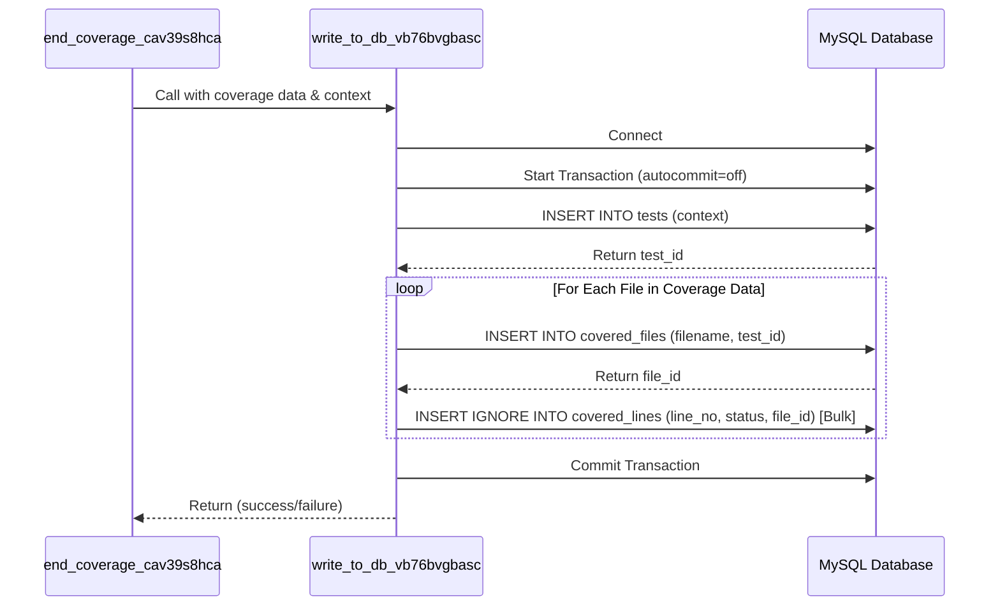

# Chapter 5: Coverage Data Persistence

Welcome to the final chapter of our core `codecoverage` tutorial! In [Chapter 4: Test Context Identification](04_test_context_identification.md), we learned how `codecoverage` successfully figures out *which* specific test run the collected data belongs to, essentially labeling our coverage information with details like the test name, group, and software version.

So now we have two key pieces of information:
1.  The raw coverage data (which lines ran in which files), gathered in [Chapter 3: Coverage Data Aggregation](03_coverage_data_aggregation.md).
2.  The context label (which test this data is for), identified in [Chapter 4: Test Context Identification](04_test_context_identification.md).

What's next? Imagine our diligent reporter has finished their interview, collected all their notes (the coverage data), and labeled the notebook clearly (the test context). What do they do now? They need to *file* this information away securely so it can be reviewed later! This final step is **Coverage Data Persistence**.

## Why Do We Need to "Persist" Data?

"Persist" is just a fancy word for "save permanently". Why is this so important?

*   **Analysis:** We want to look at the coverage results later. Which parts of the code did the "Login Success Test" actually cover? Which parts did it miss?
*   **Tracking Progress:** How does coverage change over time as we add new features or fix bugs? Does coverage improve or decrease with new versions?
*   **Comparing Tests:** Does the "Failed Login Test" cover different code paths than the "Successful Login Test"?
*   **Reporting:** We need the saved data to generate reports and dashboards showing the overall health of our code coverage.

**The Problem:** The coverage data and its context exist only in the computer's temporary memory while the PHP script is running. Once the script finishes (even with our [Graceful Shutdown Execution](02_graceful_shutdown_execution.md)), that memory is wiped clean. If we don't save the data somewhere permanent, it's lost forever!

**The Solution:** We need to take the labeled coverage data and store it in a place where it will last – typically, a database. This process involves connecting to the database and inserting the information in an organized way.

## How It Works: Saving to a Database

The `codecoverage` tool saves the information into a structured database (specifically, a MySQL database in this project). Think of the database as a highly organized digital filing cabinet. It has different drawers (tables) for different types of information.

Our `end_coverage_cav39s8hca` function (which runs at the end of the script) calls another helper function, `write_to_db_vb76bvgbasc`, whose sole job is to handle this saving process.

Here's a breakdown of what `write_to_db_vb76bvgbasc` does:

1.  **Connect to the Database:** Establish a connection to the MySQL database server using predefined credentials (hostname, username, password, database name).
2.  **Start a Transaction:** Tell the database, "I'm about to make several related changes. Treat them as a single unit." This ensures that if one part fails, the whole set of changes can be undone, keeping the data consistent.
3.  **Save Test Run Info:** Insert a new row into a `tests` table. This row contains the context information: the unique test name, the test group, the date/time, and IDs linking to the specific software and version being tested. The database assigns a unique ID (let's call it `test_id`) to this test run.
4.  **Save Covered File Info:** For each file that was executed during the test:
    *   Insert a new row into a `covered_files` table. This row contains the file's path/name and the `test_id` we got in the previous step (linking the file to the specific test run).
    *   The database assigns a unique ID (let's call it `file_id`) to this file entry *for this specific test run*.
5.  **Save Covered Line Info:** For each line within a covered file:
    *   Insert a new row into a `covered_lines` table. This row contains the line number, whether it was executed (the status: 1, -1, or -2), and the `file_id` we just got (linking the line to the specific file within that test run).
6.  **Commit the Transaction:** Tell the database, "All the changes were successful. Make them permanent!"

Let's look at simplified code snippets for these steps, based on the `write_to_db_vb76bvgbasc` function in `start_xdebug.php`.

**Step 1: Connect to the Database**

```php
<?php
// Inside write_to_db_vb76bvgbasc(...)

// Database connection details (server, user, password, db name)
$mysqli = new mysqli("db", "root", "root", "code_coverage");

// Check if the connection failed
if (mysqli_connect_errno()) {
  error_log("Connect failed: " . mysqli_connect_error());
  // Stop if we can't connect
  exit();
}
?>
```
**Explanation:**
*   `new mysqli(...)`: This line creates a new connection object to the MySQL database running on the host named "db", using the username "root", password "root", and selecting the database named "code_coverage".
*   `mysqli_connect_errno()`: Checks if an error occurred during the connection attempt.

**Step 2 & 6: Transactions**

```php
<?php
// Inside write_to_db_vb76bvgbasc(...)

// Tell MySQL not to save changes automatically yet
$mysqli->autocommit(FALSE);

// ... (All the insert steps happen here) ...

// If everything went well, make all changes permanent
$mysqli->commit();
?>
```
**Explanation:**
*   `$mysqli->autocommit(FALSE);`: This turns off the default behavior where every single SQL command is saved immediately. We want to group our inserts.
*   `$mysqli->commit();`: This command tells the database to save *all* the changes made since `autocommit(FALSE)` was called. If any error occurred before this point, the changes would typically be rolled back (discarded).

**Step 3: Save Test Run Info**

```php
<?php
// Inside write_to_db_vb76bvgbasc(...)

$test_id = 0; // Variable to store the ID of the new test run

// Prepare the SQL command to insert into the 'tests' table
// ON DUPLICATE KEY UPDATE helps handle cases if the same test name runs quickly
$sql = 'INSERT INTO tests (test_name, test_group, test_date, fk_software_id, fk_software_version_id)
        VALUES (?,?,?,?,?) ON DUPLICATE KEY UPDATE id=LAST_INSERT_ID(id)';

if ($stmt = $mysqli->prepare($sql)) {
    $date = date("Y-m-d H:i:s"); // Get current date and time
    // Bind the actual values (from context) to the '?' placeholders
    $stmt->bind_param("sssii", $coverageName, $test_group, $date, $fk_software_id, $fk_software_version_id);
    // Execute the command
    $stmt->execute();
    // Get the unique ID generated by the database for this new row
    $test_id = mysqli_insert_id($mysqli);
    $stmt->close(); // Clean up
} else {
  error_log("Error preparing test insert: " . $mysqli->error);
}
?>
```
**Explanation:**
*   `INSERT INTO tests ... VALUES (?,?,?,?,?)`: This is the SQL command. The `?` are placeholders for the actual data.
*   `$mysqli->prepare($sql)`: Prepares the SQL command for execution. This is a security best practice to prevent SQL injection attacks.
*   `$stmt->bind_param("sssii", ...)`: Binds the PHP variables (`$coverageName`, `$test_group`, etc.) to the `?` placeholders. `"sssii"` tells MySQL the data types: `s` for string, `i` for integer.
*   `$stmt->execute()`: Runs the SQL command with the bound values.
*   `mysqli_insert_id($mysqli)`: Retrieves the unique ID automatically generated by the database for the row we just inserted. We store this in `$test_id`.

**Step 4: Save Covered File Info (Inside a Loop)**

```php
<?php
// Inside write_to_db_vb76bvgbasc(...)

// Assume $codecoverageData holds the JSON string from Xdebug
$coverageInfo = json_decode($codecoverageData);

// Loop through each file found in the coverage data
foreach ($coverageInfo as $filename => $lineData) {
    $file_id = 0; // To store the ID for this file entry

    // Prepare SQL to insert into 'covered_files' table
    $sql = 'INSERT INTO covered_files (file_name, fk_test_id)
            VALUES (?,?) ON DUPLICATE KEY UPDATE id=LAST_INSERT_ID(id)';

    if ($stmt = $mysqli->prepare($sql)) {
        // Bind filename and the $test_id (from Step 3)
        $stmt->bind_param("si", $filename, $test_id);
        $stmt->execute();
        // Get the unique ID for this specific file entry
        $file_id = mysqli_insert_id($mysqli);
        $stmt->close();
    } else {
      error_log("Error preparing file insert: " . $mysqli->error);
    }

    // Now, process the lines for this file using $file_id... (See Step 5)
}
?>
```
**Explanation:**
*   `foreach ($coverageInfo as $filename => $lineData)`: This loop iterates over each file recorded in the coverage data. `$filename` gets the file path, and `$lineData` gets the array of line statuses.
*   `INSERT INTO covered_files ...`: Inserts the file's name and the `$test_id` (linking it back to the overall test run).
*   `$file_id = mysqli_insert_id($mysqli)`: Gets the unique ID for this row in the `covered_files` table.

**Step 5: Save Covered Line Info (Bulk Insert)**

```php
<?php
// Inside the file loop from Step 4

$str_line_coverage = ''; // String to build bulk insert values

// Loop through each line and its status for the current file
foreach($lineData as $line_no => $status) {
    if ($str_line_coverage !== '') {
        $str_line_coverage .= ', '; // Add comma between value sets
    }
    // Format: (line_number, status, file_id)
    $str_line_coverage .= sprintf('(%d, %d, %d)', $line_no, $status, $file_id);
}

// After looping through all lines for the file, insert them all at once
if (!empty($str_line_coverage)) {
    // INSERT IGNORE avoids errors if we try to insert a duplicate line for some reason
    $sql = 'INSERT IGNORE INTO covered_lines (line_number, run, fk_file_id) VALUES ' . $str_line_coverage;
    if ($stmt = $mysqli->prepare($sql)) {
        $stmt->execute(); // Execute the bulk insert
        $stmt->close();
    } else {
        error_log("Error preparing lines insert: " . $mysqli->error);
    }
}
?>
```
**Explanation:**
*   `foreach($lineData as $line_no => $status)`: This inner loop goes through each line number and its execution status (`1`, `-1`, or `-2`) for the current file.
*   `$str_line_coverage .= ...`: Instead of inserting one line at a time (which is slow), we build a long string containing all the values formatted like `(10, 1, 123), (12, -2, 123), (15, 1, 123)...`. Here, `123` is the `$file_id`.
*   `INSERT IGNORE INTO covered_lines ... VALUES ...`: This single SQL command inserts all the line data for the current file in one go. `IGNORE` tells MySQL to just skip if it finds a duplicate primary key (e.g., same line number for the same file ID), preventing errors.

## Under the Hood: The Persistence Flow

Let's visualize the interaction when the shutdown function decides to save the data:

1.  The main shutdown function (`shutdown_kdnw92j`) calls the cleanup and saving function (`end_coverage_cav39s8hca`).
2.  `end_coverage_cav39s8hca` aggregates the data ([Chapter 3: Coverage Data Aggregation](03_coverage_data_aggregation.md)) and identifies the context ([Chapter 4: Test Context Identification](04_test_context_identification.md)).
3.  It then calls the dedicated database function (`write_to_db_vb76bvgbasc`) passing the coverage data and context.
4.  `write_to_db_vb76bvgbasc` connects to the database.
5.  It inserts the test context into the `tests` table and gets the `test_id`.
6.  It loops through the coverage data:
    *   Inserts file info into `covered_files` using the `test_id` and gets the `file_id`.
    *   Inserts all line info for that file into `covered_lines` using the `file_id`.
7.  After processing all files, it commits the transaction.
8.  The database connection is closed (implicitly when the script ends or explicitly).



This diagram shows the sequence: the cleanup function triggers the persistence function, which then interacts with the database to insert records into the `tests`, `covered_files`, and `covered_lines` tables within a transaction.

## Conclusion

And that's the final step in our core `codecoverage` journey: **Coverage Data Persistence**! We learned why it's crucial to save the labeled coverage data and how `codecoverage` achieves this by:

1.  Connecting to a MySQL database.
2.  Using transactions for data integrity.
3.  Inserting the test context (name, group, version) into a `tests` table.
4.  Iterating through the coverage data and inserting file information into a `covered_files` table, linked to the test run.
5.  Inserting the execution status for each line into a `covered_lines` table, linked to the specific file.

From starting the recording with the [Coverage Collection Trigger](01_coverage_collection_trigger.md), ensuring cleanup with [Graceful Shutdown Execution](02_graceful_shutdown_execution.md), gathering the raw data via [Coverage Data Aggregation](03_coverage_data_aggregation.md), labeling it with [Test Context Identification](04_test_context_identification.md), to finally saving it permanently with **Coverage Data Persistence** (this chapter), we've seen the complete flow of how `codecoverage` collects detailed information about your code's execution during tests.

With the data safely stored in the database, it's now ready for analysis, reporting, and helping you understand and improve your code quality!

---

Generated by [AI Codebase Knowledge Builder](https://github.com/The-Pocket/Tutorial-Codebase-Knowledge)