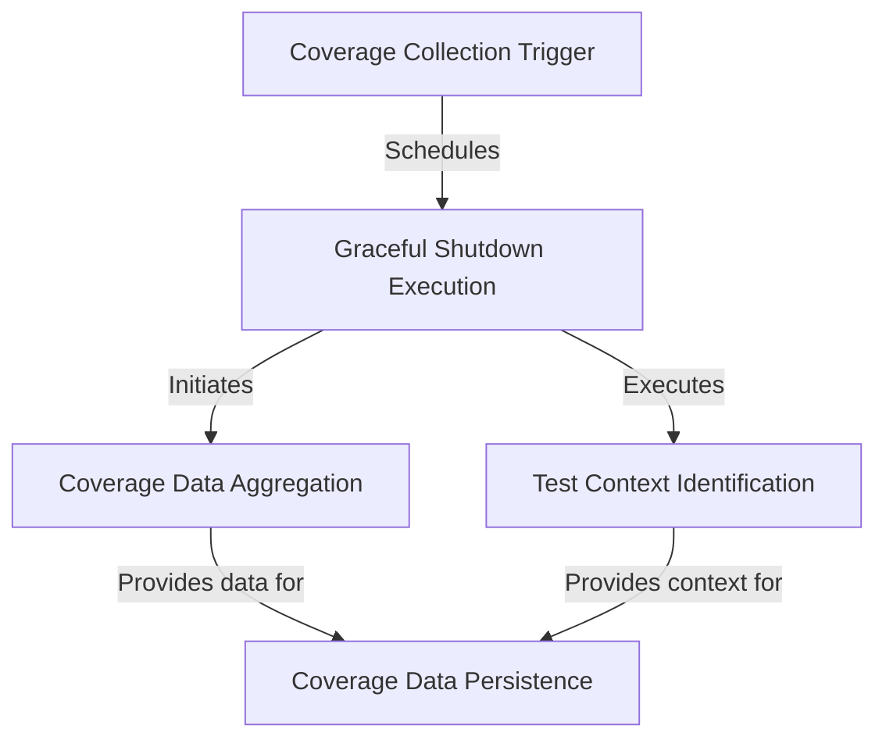

# Tutorial: codecoverage

This project automatically **records** which lines of PHP code are executed during a script's run, typically during *testing*.
It uses the **Xdebug** tool to gather this *code coverage* information.
After the script finishes, it **identifies** the test context (like the test name) and **stores** the coverage data along with the context into a database for later analysis.

**Source Repository:** [None](None)

## Chapters

1. [Coverage Collection Trigger](01_coverage_collection_trigger.md)
2. [Graceful Shutdown Execution](02_graceful_shutdown_execution.md)
3. [Coverage Data Aggregation](03_coverage_data_aggregation.md)
4. [Test Context Identification](04_test_context_identification.md)
5. [Coverage Data Persistence](05_coverage_data_persistence.md)

---

Generated by [AI Codebase Knowledge Builder](https://github.com/The-Pocket/Tutorial-Codebase-Knowledge)