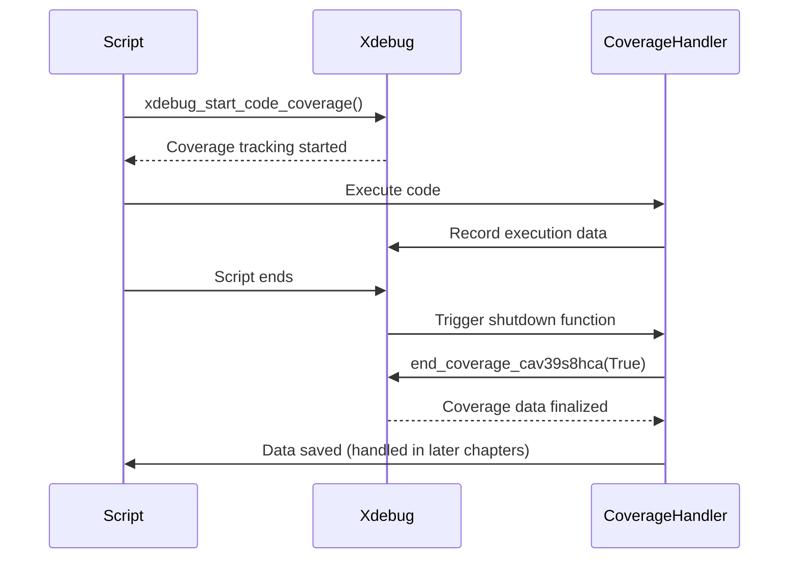

# Chapter 1: Code Coverage Initialization

Welcome to the first chapter of our `codecoverage` project tutorial! This chapter will cover how we get the process started for gathering code coverage data – essentially, how we “turn on the camera” to record which parts of your code are being executed during your tests.

Imagine you're testing a simple function that adds two numbers. You want to be sure that *every* line of that function is actually run during your tests. Code coverage helps you answer that question.  We need a way to tell Xdebug to start tracking which lines of code are executed. That’s what this chapter is all about.

## Why Do We Need Code Coverage Initialization?

Without code coverage initialization, Xdebug won't track anything! It’s like having a camera but forgetting to turn it on. This abstraction handles the initial setup, ensuring that Xdebug knows to start recording execution data.

## The `xdebug_start_code_coverage()` Function

The core of our initialization is the `xdebug_start_code_coverage()` function. This function, provided by the Xdebug extension, is what actually tells Xdebug to begin tracking which lines of code are executed.

Here's a simple example:

```php
<?php
    xdebug_start_code_coverage();
?>
```

This single line starts the code coverage process.  After this line, Xdebug will begin monitoring your code's execution.  It's a very simple function with no arguments, but it’s crucial to running your tests with coverage data.

## Shutdown Functions: Ensuring Data is Collected

When your script finishes (either normally or due to an error), we need to make sure that the coverage data collected by Xdebug is properly saved.  This is where shutdown functions come in. Shutdown functions are special functions that are automatically executed when the script ends.

Our project uses a clever trick to ensure our shutdown function runs *last*.  We register a shutdown function *inside* another shutdown function. This guarantees that the last function registered is the one that actually calls `end_coverage_cav39s8hca()`.

Let's break down the relevant code:

```php
<?php
    function shutdown_ashd9va()
    {
        register_shutdown_function('shutdown_kdnw92j');
    }

    function shutdown_kdnw92j()
    {
        end_coverage_cav39s8hca(True);
    }

    register_shutdown_function('shutdown_ashd9va');
?>
```

*   `shutdown_ashd9va()`: This function registers `shutdown_kdnw92j()` as a shutdown function.
*   `shutdown_kdnw92j()`: This function calls `end_coverage_cav39s8hca(True)` to finalize and save the coverage data.
*   `register_shutdown_function('shutdown_ashd9va')`: This line registers `shutdown_ashd9va()` to be called when the script ends.

## Sequence Diagram: Initialization and Shutdown

Here's a simplified sequence diagram to illustrate the process:



## The `end_coverage_cav39s8hca()` Function

This function is responsible for collecting and storing the code coverage data.  It's called by our shutdown function.

```php
<?php
    function end_coverage_cav39s8hca($caller_shutdown_func=False)
    {
        $codecoverageData = json_encode(xdebug_get_code_coverage());
        if ($caller_shutdown_func) {
            xdebug_stop_code_coverage();
        }
    }
?>
```

*   `xdebug_get_code_coverage()`: This function retrieves the coverage data collected by Xdebug.
*   `json_encode()`: This converts the coverage data into a JSON string, making it easier to store and process.
*   `xdebug_stop_code_coverage()`: This function stops the coverage tracking.  The `$caller_shutdown_func` parameter is used to determine if we should stop the coverage or just get the data.

## Context and Metadata

The `end_coverage_cav39s8hca()` function also handles setting up the context for our coverage data. It grabs information like the test name, software ID, and software version ID from cookies or environment variables. This information is used to identify the test run and associate the coverage data with the correct software version.

## Conclusion

In this chapter, we've covered the essential steps for initializing code coverage. We learned how to use `xdebug_start_code_coverage()` to start tracking execution, how shutdown functions ensure data is collected, and how `end_coverage_cav39s8hca()` finalizes and prepares the data for storage.  This sets the stage for the next chapter, where we'll explore [Coverage Data Storage](02_coverage_data_storage.md) and how we actually persist the collected data.


---

Generated by [AI Codebase Knowledge Builder](https://github.com/The-Pocket/Tutorial-Codebase-Knowledge)