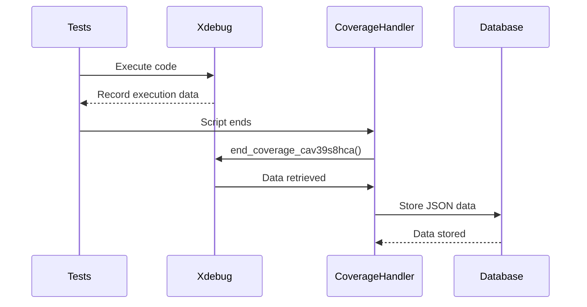

# Chapter 2: Coverage Data Storage

[Code Coverage Initialization](01_code_coverage_initialization.md) covered how we start tracking which lines of code are executed during your tests. Now, we need to *store* that information so we can analyze it later. This chapter explains how the `codecoverage` project handles this crucial task: saving the collected coverage data.

## Why Do We Need Coverage Data Storage?

Imagine running a suite of tests. Without storing the coverage data, it's like running the tests and immediately throwing away the results! We need a way to preserve the information about which lines were executed so we can see what parts of our code are truly being tested.

Let's say you're testing a complex function with many different branches. You want to know if *all* those branches are being exercised by your tests.  Coverage data storage lets us answer that question by saving the execution data and allowing us to review it later.

## The Core Idea: Saving Coverage as JSON

The `codecoverage` project uses a simple but effective approach: it converts the coverage data collected by Xdebug into a JSON string and stores it in a database. This JSON format contains detailed information about which lines were executed, how many times, and more.

## How It Works: Step-by-Step

1.  **Xdebug Collects Data:** During test execution, Xdebug keeps track of which lines are executed.
2.  **`end_coverage_cav39s8hca()` is Called:** When the tests finish, our shutdown function calls `end_coverage_cav39s8hca()`.
3.  **Data Retrieval:** `end_coverage_cav39s8hca()` uses `xdebug_get_code_coverage()` to retrieve the collected data.
4.  **JSON Conversion:**  The data is then converted into a JSON string using `json_encode()`.
5.  **Database Storage:**  Finally, the JSON string is stored in a database, along with metadata about the test run.

## The `end_coverage_cav39s8hca()` Function in Detail

Let's look at the code that handles this process:

```php
<?php
    function end_coverage_cav39s8hca($caller_shutdown_func=False)
    {
        $codecoverageData = json_encode(xdebug_get_code_coverage());
        if ($caller_shutdown_func) {
          xdebug_stop_code_coverage(); // true to destroy in memory information, not resuming later
        }
    }
?>
```

*   This function retrieves the coverage data using `xdebug_get_code_coverage()`. This function is provided by Xdebug and returns an array containing the coverage information.
*   The `json_encode()` function converts this array into a JSON string, which is easier to store and process.
*   The `$caller_shutdown_func` parameter tells us if we should stop tracking coverage after retrieving the data.

## Sequence Diagram: Data Storage

Here's a simplified sequence diagram to visualize the data storage process:



## Database Interaction

The `write_to_db_vb76bvgbasc()` function (defined in `start_xdebug.php`) handles the actual storage in the database.  It creates entries in the `tests`, `covered_files`, and `covered_lines` tables.

```php
<?php
    function write_to_db_vb76bvgbasc($coverageName, $test_group, $codecoverageData, $included_files, $fk_software_id, $fk_software_version_id)
    {
        $mysqli = new mysqli("db", "root", "root", "code_coverage");
        // ... (database connection and error handling) ...
    }
?>
```

This function first establishes a connection to the database. Then, it inserts a new record into the `tests` table, representing the test run. Next, it iterates through the JSON data to identify the covered files and lines, inserting corresponding records into the `covered_files` and `covered_lines` tables.  Finally, it commits the changes to the database.

## Conclusion

In this chapter, we’ve explored how the `codecoverage` project stores code coverage data. We learned how Xdebug's data is converted into JSON and then stored in a database, allowing us to analyze which parts of our code are being tested. This sets the stage for [Database Interaction (code_coverage)](03_database_interaction__code_coverage_.md), where we'll explore the database schema and how we interact with it to retrieve and analyze the coverage data.

---

Generated by [AI Codebase Knowledge Builder](https://github.com/The-Pocket/Tutorial-Codebase-Knowledge)