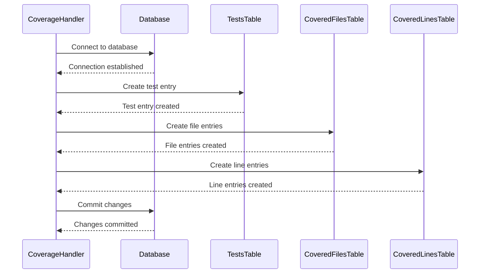

# Chapter 3: Database Interaction (code_coverage)

[Coverage Data Storage](02_coverage_data_storage.md) showed us how to convert the coverage data collected by Xdebug into a JSON string. Now, we need to *store* that data somewhere so we can analyze it later. This chapter explains how the `codecoverage` project interacts with a database to persistently store this crucial information.

## Why Do We Need Database Interaction?

Imagine running a lot of tests. If we just saved the coverage data to a file each time, our file system would quickly get cluttered!  More importantly, we’d have no easy way to compare coverage results across different tests or software versions. A database provides a structured way to store and query this data, allowing us to gain valuable insights into our code's testability.

Let's say you're making changes to a function and want to see if your changes increased or decreased code coverage.  A database lets us easily compare the coverage data before and after your changes.

## The Big Picture: Database Tables

The `codecoverage` project uses a relational database (specifically, MySQL) to store the coverage data.  The database has three main tables:

*   **`tests`:** Stores information about each test run, like the test name, group, and date.
*   **`covered_files`:**  Lists the files that were covered during a specific test run.
*   **`covered_lines`:**  Records which lines within each file were executed during a test run.

Think of it like organizing a library. The `tests` table is like the catalog, `covered_files` are the shelves with books, and `covered_lines` are the specific pages read in each book.

## How It Works: Storing the Data

1.  **Data is Ready:**  The `end_coverage_cav39s8hca()` function (described in [Coverage Data Storage](02_coverage_data_storage.md)) has already converted the Xdebug data into a JSON string.
2.  **Database Connection:** The `write_to_db_vb76bvgbasc()` function establishes a connection to the MySQL database.
3.  **Test Entry:** A new entry is created in the `tests` table, storing metadata about the test run (name, group, date, software ID, and version ID).
4.  **File Entries:** The function then iterates through the JSON data, identifying the files that were covered. For each file, a new entry is created in the `covered_files` table, linking it to the test run.
5.  **Line Entries:** Finally, for each file, the function iterates through the lines of code and creates entries in the `covered_lines` table, indicating whether each line was executed.

## Sequence Diagram: Database Storage

Here’s a simplified sequence diagram illustrating the process:



## Diving into the Code: `write_to_db_vb76bvgbasc()`

Let's look at the core function responsible for writing the data to the database:

```php
<?php
    function write_to_db_vb76bvgbasc($coverageName, $test_group, $codecoverageData, $included_files, $fk_software_id, $fk_software_version_id)
    {
        $mysqli = new mysqli("db", "root", "root", "code_coverage");
        // ... (database connection and error handling) ...
    }
?>
```

This function first creates a new MySQLi object to connect to the database.  The connection details (host, username, password, database name) are hardcoded here for simplicity. In a real-world application, these would be stored in configuration files.

The rest of the function handles creating the database entries as described above. The code uses prepared statements to prevent SQL injection vulnerabilities, which is a very important security practice.

## Example: Storing a Simple Test Run

Let's say we ran a test named "MyTest" on software version 1. The `write_to_db_vb76bvgbasc()` function would:

1.  Insert a row into the `tests` table with `test_name = "MyTest"`, `test_group = "default"`, `fk_software_id = 1`, and `fk_software_version_id = 1`.
2.  If the JSON data indicates that `file.php` was covered, it would insert a row into the `covered_files` table with `file_name = "file.php"` and link it to the test ID.
3.  If `file.php` contains a line of code that was executed, it would insert a row into the `covered_lines` table with `line_number = 10`, `run = 1` (indicating it was executed), and link it to the file ID.

## Conclusion

In this chapter, we learned how the `codecoverage` project interacts with a database to store coverage data. We explored the structure of the database tables and the process of writing data to them. This allows us to efficiently query and analyze coverage information, providing valuable insights into our code’s testability. Next, we'll look at [Test Metadata Handling](04_test_metadata_handling.md) and how we manage the metadata associated with each test run.

---

Generated by [AI Codebase Knowledge Builder](https://github.com/The-Pocket/Tutorial-Codebase-Knowledge)