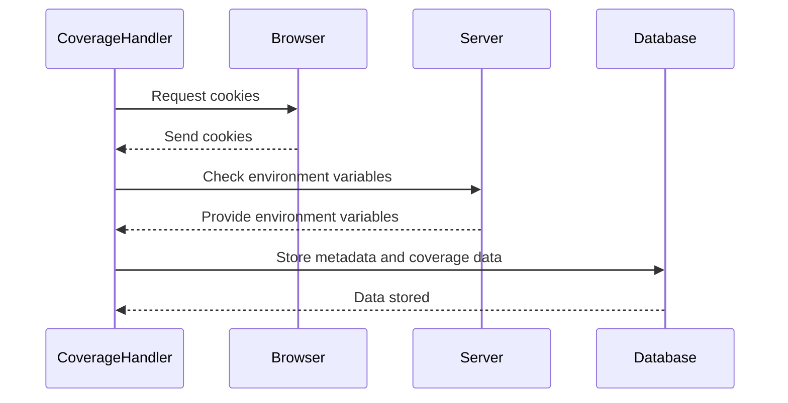

# Chapter 4: Test Metadata Handling

[Coverage Data Storage](02_coverage_data_storage.md) showed us how to store the collected code coverage data. But, how do we make sure that coverage data is properly labeled and categorized? Imagine running the same test multiple times, or running different tests on different versions of your software. Without proper labeling, it would be impossible to tell which coverage data belongs to which test run! This chapter explains how the `codecoverage` project handles this crucial task: managing test metadata like test name, group, software ID, and version.

## Why Do We Need Test Metadata?

Think of it like organizing photos. You could just dump all your photos into a single folder, but that would be a mess! Instead, you organize them by date, event, or location. Test metadata is like that organization system for your coverage data.  It allows us to easily identify and filter coverage results based on various criteria.

For example, you might want to compare the coverage of a new feature across different software versions. Test metadata allows you to quickly find the coverage data for those specific versions and make a comparison.

## The Core Idea: Gathering Metadata from Cookies and Environment Variables

The `codecoverage` project retrieves test metadata from two sources:

*   **Cookies:**  These are small pieces of data stored in the user's browser. We can use cookies to pass information like the test name and test group.
*   **Environment Variables:** These are variables set in the server environment, often in a `.htaccess` file.  We can use environment variables to pass information like the software ID and version ID.

This approach allows for flexibility in how the metadata is provided.

## How It Works: Step-by-Step

1. **Retrieve Metadata:** The `end_coverage_cav39s8hca()` function first tries to retrieve the test metadata from cookies.
2. **Fallback to Environment Variables:** If the metadata is not found in the cookies, it falls back to looking for it in environment variables.
3. **Default Values:** If the metadata is not found in either cookies or environment variables, it uses default values.
4. **Store Metadata:** The function then stores this metadata along with the coverage data in the database.

## Sequence Diagram: Metadata Retrieval

Here's a simplified sequence diagram to illustrate the process:



## Diving into the Code: `end_coverage_cav39s8hca()`

Let's look at the core function responsible for retrieving and storing the metadata:

```php
<?php
    function end_coverage_cav39s8hca($caller_shutdown_func=False)
    {
        $current_dir = __DIR__;
        $test_name = (isset($_COOKIE['test_name']) && !empty($_COOKIE['test_name'])) ? htmlspecialchars($_COOKIE['test_name'],ENT_QUOTES, 'UTF-8') : 'unknown_test_' . time();
        $fk_software_id = (isset($_COOKIE['software_id']) && !empty($_COOKIE['software_id'])) ? intval($_COOKIE['software_id']) : -1;
        $fk_software_version_id = (isset($_COOKIE['software_version_id']) && !empty($_COOKIE['software_version_id'])) ? intval($_COOKIE['software_version_id']) : -1;
        $test_group = (isset($_COOKIE['test_group']) && !empty($_COOKIE['test_group'])) ? htmlspecialchars($_COOKIE['test_group'],ENT_QUOTES, 'UTF-8') : 'default';
        if ($test_group == 'default') {
            // Try to read values from .htaccess
            $cfg_test_group = getenv('lim_test_group');
            $cfg_test_name = getenv('lim_test_name');
            $cfg_fk_software_id = getenv('lim_software_id');
            $cfg_fk_software_version_id = getenv('lim_software_version_id');
            if (isset($cfg_test_group)) {
                $test_group = $cfg_test_group;
            }
            if (isset($cfg_test_name)) {
                $test_name = $cfg_test_name;
            }
            if (isset($cfg_fk_software_id)) {
                $fk_software_id = $cfg_fk_software_id;
            }
            if (isset($cfg_fk_software_version_id)) {
                $fk_software_version_id = $cfg_fk_software_version_id;
            }
        }
    }
?>
```

This code snippet first checks for the presence of `test_name`, `software_id`, `software_version_id`, and `test_group` in the cookies. If they are not found, it checks for environment variables named `lim_test_group`, `lim_test_name`, `lim_software_id` and `lim_software_version_id`. Default values are used if neither cookies nor environment variables contain the metadata. These values are then used during database storage.

## Example: Setting Cookies

To set the cookies, you could use JavaScript:

```javascript
document.cookie = "test_name=MyTest; path=/";
document.cookie = "test_group=Integration; path=/";
document.cookie = "software_id=1; path=/";
document.cookie = "software_version_id=10; path=/";
```

This would set the test name to "MyTest", the test group to "Integration", the software ID to 1, and the software version ID to 10.

## Conclusion

In this chapter, we’ve explored how the `codecoverage` project handles test metadata. We learned how to retrieve metadata from cookies and environment variables and how it's used to properly label and categorize coverage data. This allows us to easily track and compare coverage results across different tests and software versions. Next, we'll look at [File Coverage Reporting](05_file_coverage_reporting.md).


---

Generated by [AI Codebase Knowledge Builder](https://github.com/The-Pocket/Tutorial-Codebase-Knowledge)