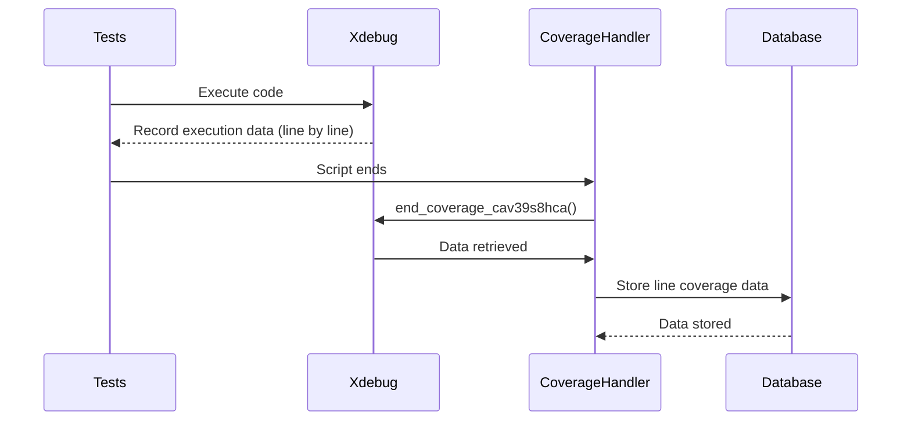

# Chapter 5: File Coverage Reporting

[File Coverage Reporting](04_test_metadata_handling.md) covered how we manage the metadata associated with each test run. Now, we want to see *which lines of code* within each file were actually executed during the test. This chapter explains how the `codecoverage` project provides file coverage reporting - essentially, highlighting the lines of code that were used during testing, allowing you to quickly identify areas that need more test coverage.

## Why Do We Need File Coverage Reporting?

Imagine you have a large codebase. After running your tests, you want to quickly see which files have good coverage and which have gaps. File coverage reporting helps you answer that question. It's like having a color-coded map of your code, where green indicates lines that were executed and red indicates lines that were not.

Let’s say you’re working on a new feature and want to ensure that all the code you wrote is being tested. File coverage reporting lets you easily identify any untested lines within your feature’s files.

## The Core Idea: Line-by-Line Execution Tracking

The `codecoverage` project tracks which lines of code are executed within each file. During test execution, Xdebug records this information.  We then store this data in the database and can use it to generate reports.

## How It Works: Step-by-Step

1. **Xdebug Tracks Execution:** During tests, Xdebug records which lines of code are executed in each file.
2. **Data is Stored:** The `end_coverage_cav39s8hca()` function (described in [Coverage Data Storage](02_coverage_data_storage.md)) stores this line-by-line execution data in the `covered_lines` table of the database.
3. **Reporting (Future Chapter):**  (We'll cover how to *generate* the reports in a later chapter.) For now, understand that the data is stored in a format that allows us to easily determine which lines were executed in each file.

## Sequence Diagram: File Coverage Tracking

Here's a simplified sequence diagram to visualize the process:



## Diving into the Code: `write_to_db_vb76bvgbasc()`

The core of the file coverage reporting is handled within the `write_to_db_vb76bvgbasc()` function.  Let’s look at the relevant part of the code:

```php
<?php
    function write_to_db_vb76bvgbasc($coverageName, $test_group, $codecoverageData, $included_files, $fk_software_id, $fk_software_version_id)
    {
        // ... (database connection) ...

        $file_id = 0;
        // bulk insert all
        $str_line_coverage = '';
        foreach (json_decode($codecoverageData) as $filename => $values) { // Iterate over each covered file
          if ($stmt = $mysqli->prepare('INSERT INTO covered_files (file_name, fk_test_id) VALUES (?,?) ON DUPLICATE KEY UPDATE id=LAST_INSERT_ID(id)')) {
              $stmt->bind_param("si", $filename, $test_id);
              $stmt->execute(); // Insert covered files into the database
  	          $file_id = mysqli_insert_id($mysqli);
          }
          else
            error_log($mysqli->error);
          foreach($values as $line_no => $status) { // Iterate over each covered line
            if ($str_line_coverage !== '') {
              $str_line_coverage = $str_line_coverage . ', ';
            }
            $str_line_coverage = $str_line_coverage . sprintf('(%s,%s,%s)', $line_no, $status, $file_id);
          }
        }
        // Bulk insert covered lines into the database
        if ($stmt = $mysqli->prepare('INSERT IGNORE INTO covered_lines (line_number, run, fk_file_id) VALUES ' . $str_line_coverage)) {
          $stmt->execute();
        }
        else
          error_log($mysqli->error);
    }
?>
```

This code snippet iterates through the JSON data returned by Xdebug. For each file, it inserts a record into the `covered_files` table. Then, for each line within the file, it constructs a string of values to be inserted into the `covered_lines` table.  The `run` field indicates whether the line was executed (1) or not (0).  Finally, it executes a bulk insert query to efficiently store all the line coverage data.

## Example:  Coverage Data for a Single File

Let's say the JSON data for `my_file.php` looks like this:

```json
"my_file.php" : {
    "10" : 1,
    "15" : 0,
    "20" : 1
}
```

This means that line 10 and line 20 were executed during the test, while line 15 was not.  The `write_to_db_vb76bvgbasc()` function would insert records into the `covered_lines` table indicating this.

## Conclusion

In this chapter, we’ve explored how the `codecoverage` project tracks and stores file coverage data. We learned how Xdebug's line-by-line execution data is stored in the database, enabling us to generate reports and identify areas of our code that need more test coverage.  [Error Handling during Coverage](06_error_handling_during_coverage.md) will cover how we handle potential errors during the coverage process.

---

Generated by [AI Codebase Knowledge Builder](https://github.com/The-Pocket/Tutorial-Codebase-Knowledge)