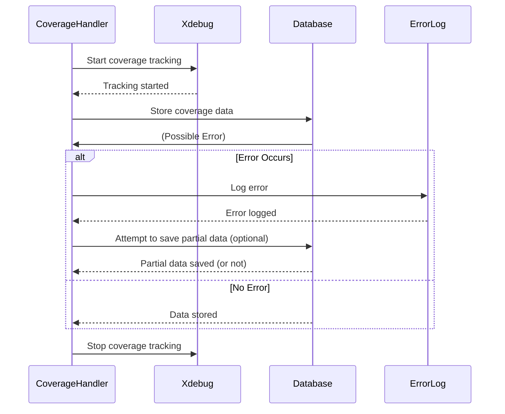

# Chapter 6: Error Handling during Coverage

[File Coverage Reporting](05_file_coverage_reporting.md) showed us how to track which lines of code are executed during tests. But what happens if something goes wrong *during* that tracking process? Imagine Xdebug crashes, or the database is temporarily unavailable. Without proper error handling, your coverage data might be incomplete or lost! This chapter explains how the `codecoverage` project handles errors during coverage collection and storage, ensuring that we have records of any problems that occur.

## Why Do We Need Error Handling during Coverage?

Think of it like a security camera. You want it to record everything, but sometimes the camera malfunctions or the power goes out. A good security system doesn't just stop recording; it logs the error so you know there was a problem.  Similarly, we need to handle errors during code coverage to ensure we know if anything went wrong and can potentially recover.

Let’s say your tests are running, and suddenly the database connection is lost. Without error handling, the coverage process might simply stop, and you’d have no idea why.  With error handling, we can log the error, try to save whatever data we have, and continue running the tests (if possible).

## The Core Idea: Catching Exceptions and Logging Errors

The core idea is to wrap the code coverage process in a `try...catch` block. This allows us to catch any exceptions (errors) that occur during data collection and storage. When an exception is caught, we log the error details to a file and, if possible, attempt to save any partial coverage data.

## How It Works: A Simple Example

1. **`try` Block:**  We wrap the code that collects and stores coverage data in a `try` block.
2. **`catch` Block:** If any exception occurs within the `try` block, the execution jumps to the `catch` block.
3. **Logging Errors:** Inside the `catch` block, we log the error message and trace to a file.  This helps us diagnose the problem later.
4. **Partial Data Saving (Optional):** If possible, we attempt to save any partial coverage data that has already been collected.  This ensures that we don't lose everything.

## Sequence Diagram: Error Handling

Here's a simplified sequence diagram illustrating this process:



## Diving into the Code: The `try...catch` Block in `end_coverage_cav39s8hca()`

The error handling is primarily implemented within the `end_coverage_cav39s8hca()` function.

```php
<?php
    function end_coverage_cav39s8hca($caller_shutdown_func=False)
    {
        $current_dir = __DIR__;
        try {
            $codecoverageData = json_encode(xdebug_get_code_coverage());
            if ($caller_shutdown_func) {
              xdebug_stop_code_coverage(); // true to destroy in memory information, not resuming later
            }
            //file_put_contents($coverageName . '.json', $codecoverageData);
            //$included_files = get_included_files();
            $included_files = array();
            write_to_db_vb76bvgbasc($coverageName, $test_group, $codecoverageData, $included_files, $fk_software_id, $fk_software_version_id);
        } catch (Exception $ex) {
            error_log($ex);
            file_put_contents($coverageName . '.ex', $ex);
        }
    }
?>
```

This code snippet demonstrates the use of `try...catch`.

*   **`try`:** The main code for getting coverage data, stopping coverage, and writing to the database is placed inside the `try` block.
*   **`catch (Exception $ex)`:** If any `Exception` (which is a base class for many types of errors) occurs during the execution of the `try` block, the code jumps to the `catch` block.
*   **`error_log($ex)`:**  This line logs the error message to the server's error log.  This is useful for debugging.
*   **`file_put_contents($coverageName . '.ex', $ex)`:** This line writes the error details to a file named `coverage_name.ex`.  This provides a persistent record of the error.

## Understanding the Error Log File

When an error occurs, a file (e.g., `coverage-MyTest-2023-10-27_10-00.ex`) is created containing the error message and trace. This file can be examined to understand what went wrong.

## Conclusion

In this chapter, we've learned how the `codecoverage` project handles errors during the coverage process. By using `try...catch` blocks and logging errors, we can ensure that we have records of any problems that occur and can potentially recover from them. This improves the reliability and robustness of the coverage collection process. Next, we'll explore [Shutdown Function Chain](07_shutdown_function_chain.md) and how the shutdown functions are chained together to ensure proper cleanup and data saving.


---

Generated by [AI Codebase Knowledge Builder](https://github.com/The-Pocket/Tutorial-Codebase-Knowledge)