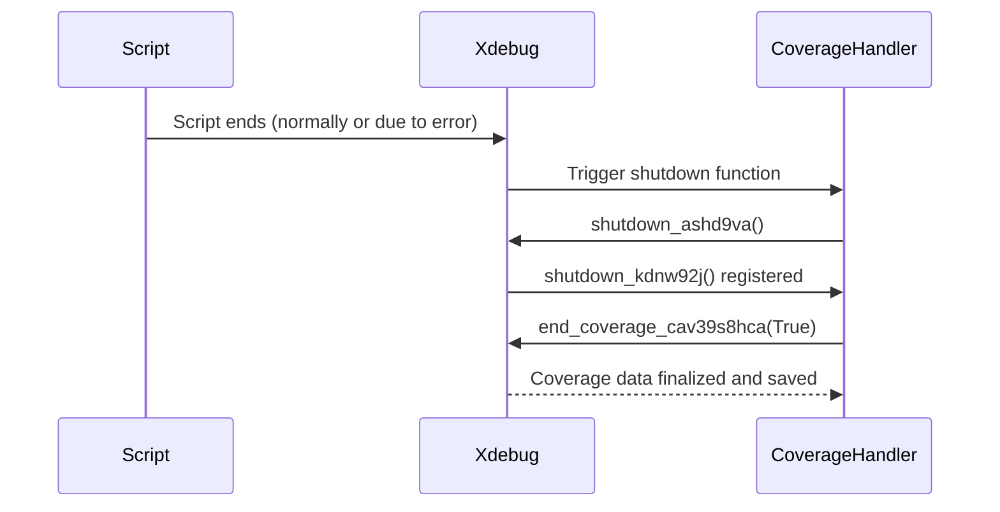

# Chapter 7: Shutdown Function Chain

Following [Error Handling during Coverage](06_error_handling_during_coverage.md), we've learned how to handle errors gracefully during code coverage collection. But even with error handling, we need to ensure that coverage data is *always* saved, even if errors occur elsewhere in our script. This is where the "Shutdown Function Chain" comes in. It's a clever way to guarantee that our final cleanup and data saving steps happen, no matter what.

## The Problem: Ensuring Data is Saved

Imagine a complex test suite. Various things can go wrong during the tests: a database connection might fail, a file might become corrupted, or an unexpected error could occur in your code.  We want to make sure that *even if* these errors happen, our code coverage data is still saved.  We don't want to lose valuable testing information because of an unexpected problem.

## The Solution: A Safety Net of Shutdown Functions

The `codecoverage` project uses a technique called a "Shutdown Function Chain" to solve this problem. Think of it as a safety net: one function registers another, which registers another, and so on, until we reach the final function that saves our data. Because of this chain, the final function is *always* called when the script ends, regardless of whether any errors occurred.

## How It Works: Nested Shutdown Functions

The core idea is to nest shutdown functions.  Let's break down the relevant code:

```php
<?php
    function shutdown_ashd9va()
    {
        register_shutdown_function('shutdown_kdnw92j');
    }

    function shutdown_kdnw92j()
    {
        end_coverage_cav39s8hca(True);
    }

    register_shutdown_function('shutdown_ashd9va');
?>
```

*   `shutdown_ashd9va()`: This function registers `shutdown_kdnw92j()` as a shutdown function.  Think of it as "passing the baton" to the next function.
*   `shutdown_kdnw92j()`: This function calls `end_coverage_cav39s8hca(True)` to finalize and save the coverage data. This is our ultimate cleanup step!
*   `register_shutdown_function('shutdown_ashd9va')`: This line registers `shutdown_ashd9va()` to be called when the script ends. It starts the whole chain.

Because `shutdown_ashd9va` registers `shutdown_kdnw92j`, and `shutdown_kdnw92j` saves the data, we're guaranteed that the data will be saved, even if errors happen before.

## Sequence Diagram: The Shutdown Chain

Here's a simplified sequence diagram to visualize the shutdown chain:



## Diving Deeper: Why Nested Shutdown Functions?

PHP's `register_shutdown_function` works on a first-registered, first-called basis. However, when you register a shutdown function *from within* another shutdown function, the newly registered function gets priority. This means `shutdown_kdnw92j` will *always* be called last, ensuring our data is saved.

## The Role of `end_coverage_cav39s8hca()`

As we've seen in previous chapters, `end_coverage_cav39s8hca()` is responsible for retrieving and saving the coverage data.  It’s the final step in the shutdown chain, ensuring that our data is safely stored.

## Why is this important?

Without this chain, if an error occurred *before* `end_coverage_cav39s8hca()` was called, the data would be lost. The shutdown function chain provides a safety net, ensuring that cleanup happens regardless of errors.

## Conclusion

In this chapter, we learned about the Shutdown Function Chain, a clever technique to guarantee that code coverage data is always saved, even if errors occur during the test process.  By nesting shutdown functions, we create a safety net that ensures our data is protected. This reliable data storage is crucial for effective code coverage analysis. Next, we'll wrap up the tutorial with a summary of everything we've learned.


---

Generated by [AI Codebase Knowledge Builder](https://github.com/The-Pocket/Tutorial-Codebase-Knowledge)