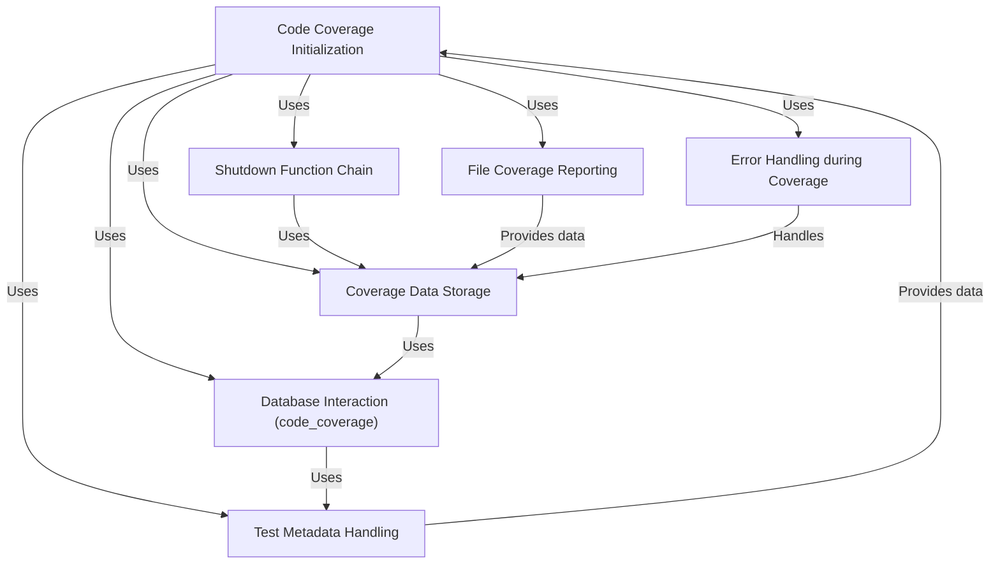

# Tutorial: codecoverage

This project, `codecoverage`, aims to automatically track and store code coverage information during testing. It uses *Xdebug* to record which lines of code are executed, then stores this data in a database for later analysis. The system utilizes **shutdown functions** to ensure data is saved even if errors occur and retrieves test metadata from cookies or environment variables.


**Source Repository:** [None](None)


```

## Chapters

1. [Code Coverage Initialization](01_code_coverage_initialization.md)
2. [Coverage Data Storage](02_coverage_data_storage.md)
3. [Database Interaction (code_coverage)](03_database_interaction__code_coverage_.md)
4. [Test Metadata Handling](04_test_metadata_handling.md)
5. [File Coverage Reporting](05_file_coverage_reporting.md)
6. [Error Handling during Coverage](06_error_handling_during_coverage.md)
7. [Shutdown Function Chain](07_shutdown_function_chain.md)


---

Generated by [AI Codebase Knowledge Builder](https://github.com/The-Pocket/Tutorial-Codebase-Knowledge)
